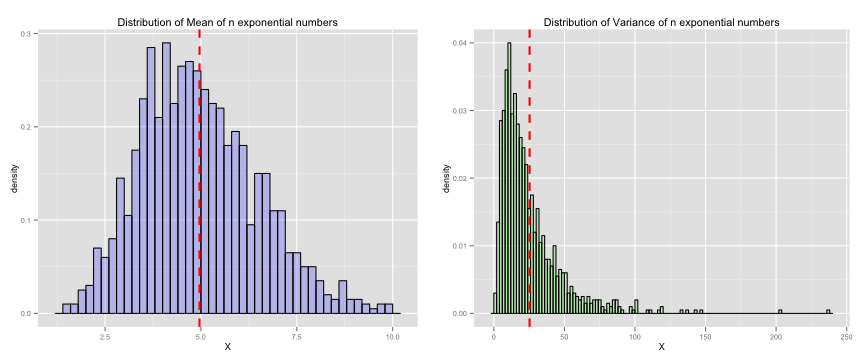

## Introduction...

This is a simple application to simulate the exponential distribution in R using rexp(n, lambda) over t times. 

Users have the options to select the parameters:

1. n - number of exponential numbers
2. $\lambda$ (lambda)  - rate parameter
3. t - number of simulations

The application will then display the following:
* the theoretical mean and variance; and 
* plot the distribution of mean and variance

---  

## Exponential Distribution

Theoretical Mean:

* The mean or expected value of an exponentially distributed random variable X with rate parameter lambda is given by

$$E[X] = \frac{1}{\lambda}$$

Theoretical Variance:
* The variance of X is given by

$$Var[X] = \frac{1}{\lambda^2}$$

---

## Demonstration

With the input of n = 10, lambda = 0.2, t = 1000, the application will display:

 
Theoretical Mean: E[X] = 5, Theoretical Variance: Var[X] = 25

 

---

## References

[Application](http://lsteo.shinyapps.io/exponential) - hosted on shinyapps.io

[Exponential Distribution](http://en.wikipedia.org/wiki/Exponential_distribution) on Wikipedia
